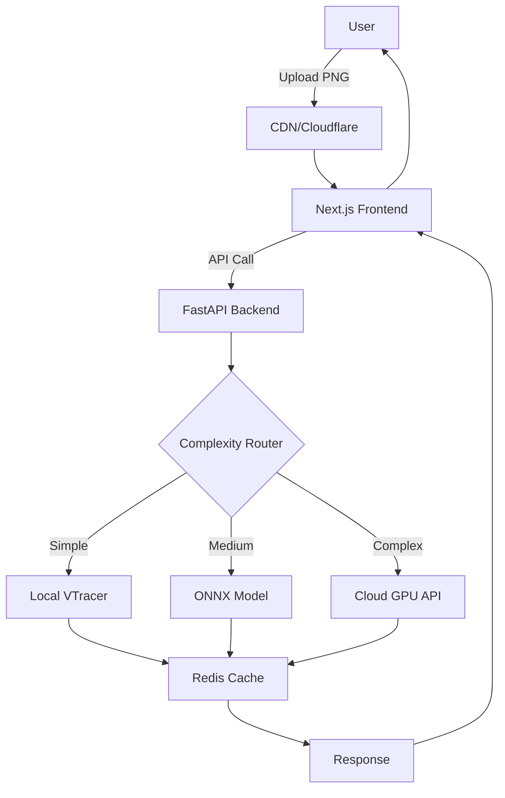

# PNG to SVG AI Conversion: Comprehensive Project Plan
## Personal Experimentation → Production Web App

### Project Overview
**Goal:** Build a logo-focused PNG-to-SVG AI converter that starts as a personal experiment and scales to a deployable web application.
**Primary Focus:** Logo conversion with high accuracy
**Budget:** Minimal ($0-20/month, leveraging free tiers)
**Platform:** MacBook 2019 (CPU-only) + Cloud GPU for training/heavy inference

---

## 1. Technical Stack & Architecture

### 1.1 Core ML Stack
```yaml
# Development Environment
Local (MacBook):
  - Python: 3.9-3.11 (avoid 3.12 for compatibility)
  - Virtual Environment: conda or venv
  - Package Manager: pip + poetry for dependency management

# ML Frameworks
Primary:
  - PyTorch: 2.0+ (CPU version for local, CUDA for cloud)
  - Transformers: Hugging Face (for VLM models)
  - ONNX Runtime: For optimized CPU inference

Logo-Specific Libraries:
  - Pillow: Image preprocessing
  - svgwrite/svgpathtools: SVG manipulation
  - cairosvg: SVG rendering/validation
  - opencv-python: Advanced image processing
```

### 1.2 Web Application Stack
```yaml
# Backend (API-First Design)
Framework: FastAPI (async, auto-docs, perfect for ML)
Components:
  - FastAPI: 0.104+
  - Pydantic: Data validation
  - Celery: Background task queue (for heavy processing)
  - Redis: Cache & task queue broker
  - SQLite/PostgreSQL: Job tracking & user management

# Frontend Options (Progressive Enhancement)
Phase 1 (MVP):
  - Vanilla HTML/CSS/JS with Tailwind CSS
  - AlpineJS for reactivity

Phase 2 (Full App):
  - Next.js 14+ (React framework)
  - TypeScript
  - Tailwind CSS
  - Shadcn/ui components
  - React Dropzone for file uploads

# Deployment & Infrastructure
Containerization:
  - Docker & Docker Compose
  - Multi-stage builds for size optimization

Hosting (Free/Low-Cost):
  - Backend: Railway.app or Fly.io (free tier)
  - Frontend: Vercel (free for personal)
  - Model Serving: Replicate.com or Modal.com
  - Storage: Cloudflare R2 (10GB free)
```

### 1.3 ML Model Architecture Strategy

```python
# Modular Model Interface (supports swapping models)
class SVGConverter(ABC):
    @abstractmethod
    def convert(self, image: PIL.Image) -> str:
        pass

class OmniSVGConverter(SVGConverter):
    # Primary: OmniSVG for quality
    pass

class VTracerConverter(SVGConverter):
    # Fallback: VTracer for speed
    pass

class APIConverter(SVGConverter):
    # Cloud: Replicate API for heavy lifting
    pass
```

---

## 2. Development Phases

### Phase 1: Local Proof of Concept (Weeks 1-2)
**Goal:** Get working PNG→SVG conversion on MacBook

```bash
# Setup Commands
git init svg-ai-converter
cd svg-ai-converter
python -m venv venv
source venv/bin/activate
pip install torch torchvision --index-url https://download.pytorch.org/whl/cpu
pip install transformers pillow fastapi uvicorn
```

**Tasks:**
- [ ] Set up VTracer (Rust-based, CPU-friendly) as baseline
- [ ] Implement OmniSVG inference with CPU-optimized settings
- [ ] Create simple CLI tool for testing
- [ ] Build test dataset of 50 sample logos
- [ ] Benchmark quality vs speed on MacBook

**Free Resources:**
- VTracer: Open source, runs great on CPU
- OmniSVG weights: Available on Hugging Face
- Test logos: Logoipsum.com, SVGRepo

### Phase 2: Cloud Integration & Optimization (Weeks 3-4)
**Goal:** Leverage free cloud GPU for better quality

**Google Colab Setup:**
```python
# colab_inference.ipynb
!pip install transformers torch torchvision
!git clone https://github.com/OmniSVG/OmniSVG.git

# Mount Google Drive for persistent storage
from google.colab import drive
drive.mount('/content/drive')

# Run inference on batch
def process_batch(input_dir, output_dir):
    # Process logos with GPU acceleration
    pass
```

**Replicate.com Integration:**
```python
# replicate_api.py
import replicate

class ReplicateConverter(SVGConverter):
    def convert(self, image):
        output = replicate.run(
            "omnissvg/logo-vectorizer:latest",  # Deploy your model
            input={"image": image}
        )
        return output['svg']
```

**Modal.com Alternative:**
```python
# modal_deploy.py
import modal

stub = modal.Stub("svg-converter")
image = modal.Image.debian_slim().pip_install(["torch", "transformers"])

@stub.function(image=image, gpu="t4", timeout=60)
def convert_png_to_svg(image_bytes):
    # GPU inference function
    return svg_string
```

### Phase 3: API Development (Weeks 5-6)
**Goal:** RESTful API with smart routing

```python
# main.py - FastAPI Application
from fastapi import FastAPI, UploadFile, BackgroundTasks
from fastapi.responses import JSONResponse
import asyncio

app = FastAPI(title="Logo SVG Converter")

class ConversionRouter:
    """Smart routing based on image complexity"""

    def route(self, image):
        complexity = self.analyze_complexity(image)
        if complexity < 0.3:
            return VTracerConverter()  # Fast, local
        elif complexity < 0.7:
            return ONNXConverter()     # Optimized model
        else:
            return ReplicateConverter() # Cloud GPU

@app.post("/convert")
async def convert_logo(file: UploadFile, background_tasks: BackgroundTasks):
    # Async processing with progress tracking
    job_id = create_job()
    background_tasks.add_task(process_conversion, file, job_id)
    return {"job_id": job_id}

@app.get("/status/{job_id}")
async def get_status(job_id: str):
    return {"status": get_job_status(job_id)}
```

### Phase 4: Web Interface (Weeks 7-8)
**Goal:** User-friendly web app

```jsx
// components/Converter.tsx - Next.js Component
import { useState } from 'react'
import { useDropzone } from 'react-dropzone'

export default function Converter() {
  const [svg, setSvg] = useState(null)
  const [loading, setLoading] = useState(false)

  const { getRootProps, getInputProps } = useDropzone({
    accept: {'image/png': ['.png']},
    maxSize: 5242880, // 5MB
    onDrop: async (files) => {
      setLoading(true)
      const formData = new FormData()
      formData.append('file', files[0])

      const response = await fetch('/api/convert', {
        method: 'POST',
        body: formData
      })

      const result = await response.json()
      setSvg(result.svg)
      setLoading(false)
    }
  })

  return (
    <div {...getRootProps()} className="dropzone">
      <input {...getInputProps()} />
      {/* UI Components */}
    </div>
  )
}
```

### Phase 5: Production Optimization (Weeks 9-10)
**Goal:** Scale to handle real users

**Performance Optimizations:**
```python
# optimization.py
class OptimizedPipeline:
    def __init__(self):
        # 1. Model Quantization (8-bit for 4x speedup)
        self.model = load_quantized_model()

        # 2. ONNX Conversion (2-3x faster on CPU)
        self.onnx_session = create_onnx_session()

        # 3. Redis Caching
        self.cache = redis.Redis()

        # 4. Image Preprocessing Pipeline
        self.preprocessor = LogoPreprocessor()

    def convert_with_cache(self, image_hash):
        # Check cache first
        if cached := self.cache.get(image_hash):
            return cached

        # Progressive enhancement
        simple_svg = self.fast_preview(image)  # Immediate response
        enhanced_svg = self.full_convert(image) # Background job

        return simple_svg
```

---

## 3. Budget Optimization Strategy

### 3.1 Free Tier Maximization
```yaml
Development:
  - GitHub: Free private repos + Actions (2000 min/month)
  - Google Colab: Free GPU (4-hour sessions)
  - Kaggle Notebooks: Additional 30 hours GPU/week

Deployment:
  - Vercel: Frontend hosting (free)
  - Railway/Render: Backend (free tier with limits)
  - Cloudflare: CDN + R2 storage (10GB free)
  - MongoDB Atlas: Database (512MB free)

ML Compute:
  - Replicate: $0.0002/second GPU (≈100 conversions for $1)
  - Modal: $0.00006/second GPU (even cheaper)
  - Hugging Face Spaces: Free CPU inference
```

### 3.2 Cost Progression
```
Month 1-2: $0 (all free tiers)
Month 3-4: $5-10 (occasional GPU bursts)
Month 5+:  $10-20 (heavier usage)
Production: Pay-per-use or subscription model
```

---

## 4. Logo-Specific Optimizations

### 4.1 Preprocessing Pipeline
```python
class LogoPreprocessor:
    def prepare(self, image):
        # 1. Background removal (logos often have transparency)
        image = remove_background(image)

        # 2. Color quantization (logos use limited palettes)
        image = quantize_colors(image, max_colors=8)

        # 3. Edge enhancement (logos have clean edges)
        image = enhance_edges(image)

        # 4. Resize to optimal dimensions
        image = resize_smart(image, target=512)

        return image
```

### 4.2 Post-Processing
```python
class SVGOptimizer:
    def optimize(self, svg_string):
        # 1. Path simplification
        svg = simplify_paths(svg, tolerance=0.1)

        # 2. Group similar elements
        svg = group_by_color(svg)

        # 3. Remove redundant points
        svg = remove_redundant(svg)

        # 4. Compress with SVGO
        svg = run_svgo(svg)

        return svg
```

---

## 5. Testing Strategy

### 5.1 Logo Test Dataset
```python
# Create diverse test set
test_categories = {
    "simple_geometric": 20,    # Nike, Adidas
    "text_based": 20,          # Google, Coca-Cola
    "complex_gradients": 20,   # Instagram, Firefox
    "detailed_emblems": 20,    # Starbucks, Versace
    "abstract_modern": 20      # Spotify, Airbnb
}
```

### 5.2 Quality Metrics
```python
def evaluate_conversion(original_png, generated_svg):
    metrics = {
        "visual_similarity": calculate_ssim(original, rendered_svg),
        "file_size_ratio": len(svg) / len(png),
        "path_complexity": count_svg_commands(svg),
        "color_accuracy": compare_palettes(original, svg),
        "edge_precision": measure_edge_quality(original, svg)
    }
    return metrics
```

---

## 6. Deployment Architecture



---

## 7. Implementation Timeline

### Week 1-2: Foundation
- [x] Set up development environment
- [ ] Install VTracer and test locally
- [ ] Create 50-logo test dataset
- [ ] Basic CLI converter working

### Week 3-4: ML Integration
- [ ] Set up Google Colab notebook
- [ ] Test OmniSVG on logos
- [ ] Implement model routing logic
- [ ] Create performance benchmarks

### Week 5-6: API Development
- [ ] FastAPI backend with endpoints
- [ ] Background job processing
- [ ] Caching layer
- [ ] API documentation

### Week 7-8: Web Interface
- [ ] Next.js project setup
- [ ] Upload interface
- [ ] Real-time preview
- [ ] Download options

### Week 9-10: Optimization
- [ ] Model quantization
- [ ] ONNX conversion
- [ ] Load testing
- [ ] Deploy to production

---

## 8. Key Commands & Scripts

### Quick Setup
```bash
# Clone and setup
git clone [your-repo]
cd svg-ai-converter
make setup  # Creates venv, installs deps

# Development
make dev    # Starts local server
make test   # Runs test suite
make bench  # Performance benchmarks

# Deployment
make build  # Docker build
make deploy # Deploy to cloud
```

### Essential Files Structure
```
svg-ai-converter/
├── api/
│   ├── main.py           # FastAPI app
│   ├── converters/        # Model implementations
│   ├── routers/           # API endpoints
│   └── utils/             # Helper functions
├── web/
│   ├── pages/             # Next.js pages
│   ├── components/        # React components
│   └── public/            # Static assets
├── models/
│   ├── weights/           # Model files (git-ignored)
│   ├── onnx/              # Optimized models
│   └── configs/           # Model configurations
├── tests/
│   ├── logos/             # Test images
│   └── test_*.py          # Test suites
├── docker/
│   ├── Dockerfile.api     # Backend container
│   └── Dockerfile.web     # Frontend container
├── scripts/
│   ├── setup.sh           # Initial setup
│   ├── benchmark.py       # Performance testing
│   └── optimize.py        # Model optimization
└── docker-compose.yml     # Full stack setup
```

---

## 9. Success Metrics

### MVP (Month 1)
- ✅ Convert simple logos locally in <10 seconds
- ✅ 80% visual accuracy on test set
- ✅ Working API endpoint

### Beta (Month 2)
- ✅ Web interface deployed
- ✅ <5 second conversion time
- ✅ 90% accuracy on logos
- ✅ 100 successful conversions

### Production (Month 3)
- ✅ <2 second average response
- ✅ 95% user satisfaction
- ✅ 1000+ conversions/day capacity
- ✅ <$20/month operating cost

---

## 10. Next Immediate Steps

1. **Today:**
   ```bash
   mkdir svg-ai-converter && cd svg-ai-converter
   python -m venv venv && source venv/bin/activate
   pip install fastapi uvicorn pillow requests
   ```

2. **Tomorrow:**
   - Install VTracer: `pip install vtracer`
   - Download 10 test logos
   - Create first conversion script

3. **This Week:**
   - Set up Google Colab notebook
   - Test OmniSVG inference
   - Compare quality metrics

4. **Next Week:**
   - Build FastAPI backend
   - Create Docker setup
   - Deploy MVP to Railway.app

This plan prioritizes getting a working system quickly while maintaining flexibility to scale up as needed!