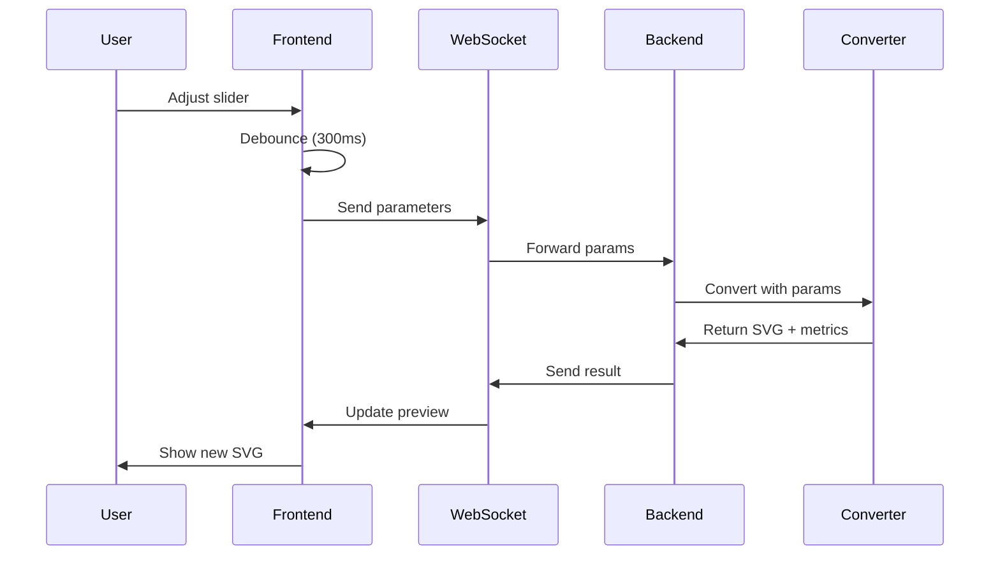

# Web Application Implementation Plan for SVG-AI Converter

## Table of Contents
1. [Project Overview](#project-overview)
2. [Current State Analysis](#current-state-analysis)
3. [Phase 1: Project Organization](#phase-1-project-organization)
4. [Phase 2: Backend Development](#phase-2-backend-development)
5. [Phase 3: Frontend Development](#phase-3-frontend-development)
6. [Phase 4: WebSocket Implementation](#phase-4-websocket-implementation)
7. [Phase 5: Integration & Testing](#phase-5-integration--testing)
8. [Implementation Timeline](#implementation-timeline)
9. [Technical Specifications](#technical-specifications)
10. [Dependencies & Requirements](#dependencies--requirements)

---

## Project Overview

### Goal
Build an interactive web application that allows users to:
- Upload PNG images via drag-and-drop or file selection
- Adjust conversion parameters in real-time with instant preview
- See side-by-side comparison of original vs converted SVG
- Monitor quality metrics (SSIM score)
- Download optimized SVG files

### Core Features
1. **Upload & Preview**
   - Drag-and-drop or click to upload PNG images
   - Split view: Original vs Converted
   - Real-time SSIM score display
   - Download converted SVG

2. **Interactive Parameter Controls**
   - Threshold slider (0-255) - Most important for icons
   - Converter selection (Potrace, VTracer, Alpha-aware)
   - Method toggles (preserve antialiasing, use binary, etc.)
   - Live preview updates as you adjust

### Technology Stack
- **Backend**: FastAPI (Python)
- **Frontend**: React with Next.js
- **Real-time**: WebSocket for instant updates
- **Existing Core**: Reuse current converter implementations

---

## Current State Analysis

### Current Project Structure Issues
- **40 Python files** in root directory (messy)
- **Mixed purposes**: Test files, optimization scripts, core logic all in root
- **No clear API layer**: Direct script execution only
- **No web interface**: Command-line only

### Existing Assets to Preserve
- `converters/` - Working converter implementations (VTracer, Potrace, Alpha)
- `utils/` - Quality metrics, image loaders, post-processors
- `data/` - Test images and logos
- Core conversion logic in various optimize_*.py files

---

## Phase 1: Project Organization

### 1.1 New Directory Structure

```
svg-ai/
├── backend/                    # FastAPI backend application
│   ├── api/                   # API endpoints
│   │   ├── __init__.py
│   │   ├── upload.py          # File upload handling
│   │   ├── convert.py         # Conversion endpoints
│   │   └── websocket.py       # WebSocket handlers
│   ├── services/              # Business logic
│   │   ├── __init__.py
│   │   ├── conversion_service.py
│   │   ├── optimization_service.py
│   │   └── cache_service.py
│   ├── models/                # Data models
│   │   ├── __init__.py
│   │   └── schemas.py         # Pydantic schemas
│   ├── config/                # Configuration
│   │   ├── __init__.py
│   │   └── settings.py
│   ├── main.py               # FastAPI app entry
│   └── requirements.txt       # Backend dependencies
│
├── frontend/                  # React application
│   ├── src/
│   │   ├── app/              # Next.js app directory
│   │   │   ├── page.tsx      # Main page
│   │   │   ├── layout.tsx    # Layout
│   │   │   └── globals.css   # Global styles
│   │   ├── components/       # React components
│   │   │   ├── FileUpload/
│   │   │   │   ├── index.tsx
│   │   │   │   └── styles.module.css
│   │   │   ├── ImageComparison/
│   │   │   │   ├── index.tsx
│   │   │   │   └── styles.module.css
│   │   │   ├── ParameterControls/
│   │   │   │   ├── index.tsx
│   │   │   │   ├── ThresholdSlider.tsx
│   │   │   │   ├── ConverterSelect.tsx
│   │   │   │   └── styles.module.css
│   │   │   └── MetricsDisplay/
│   │   │       ├── index.tsx
│   │   │       └── styles.module.css
│   │   ├── hooks/            # Custom React hooks
│   │   │   ├── useWebSocket.ts
│   │   │   ├── useImageUpload.ts
│   │   │   └── useConverter.ts
│   │   ├── services/         # API services
│   │   │   ├── api.ts
│   │   │   └── websocket.ts
│   │   └── types/            # TypeScript types
│   │       └── index.ts
│   ├── public/               # Static files
│   ├── package.json
│   ├── tsconfig.json
│   └── next.config.js
│
├── core/                     # Core conversion logic (existing code)
│   ├── converters/          # Move existing converters here
│   │   ├── __init__.py
│   │   ├── base.py
│   │   ├── vtracer_converter.py
│   │   ├── potrace_converter.py
│   │   └── alpha_converter.py
│   ├── utils/               # Move existing utils here
│   │   ├── __init__.py
│   │   ├── quality_metrics.py
│   │   ├── image_loader.py
│   │   ├── svg_post_processor.py
│   │   └── parameter_cache.py
│   └── optimizers/          # Optimization logic
│       ├── __init__.py
│       ├── icon_optimizer.py
│       └── iterative_optimizer.py
│
├── scripts/                 # Standalone scripts (organized)
│   ├── optimize/           # All optimization scripts
│   ├── test/              # All test scripts
│   ├── benchmark/         # Benchmark scripts
│   └── batch/            # Batch processing scripts
│
├── data/                   # Keep as is
├── tests/                  # Keep as is
├── docs/                   # Documentation
│   └── API.md             # API documentation
└── docker/                # Docker configuration
    ├── Dockerfile.backend
    ├── Dockerfile.frontend
    └── docker-compose.yml
```

### 1.2 File Migration Map

| Current Location | New Location |
|-----------------|--------------|
| `optimize_*.py` | `scripts/optimize/` |
| `test_*.py` | `scripts/test/` |
| `batch_*.py` | `scripts/batch/` |
| `benchmark*.py` | `scripts/benchmark/` |
| `convert.py` | `core/` |
| `converters/` | `core/converters/` |
| `utils/` | `core/utils/` |

---

## Phase 2: Backend Development

### 2.1 FastAPI Application Structure

#### Main Application (`backend/main.py`)
```python
from fastapi import FastAPI, WebSocket
from fastapi.middleware.cors import CORSMiddleware
from contextlib import asynccontextmanager
import sys
import os

# Add core to path
sys.path.insert(0, os.path.join(os.path.dirname(__file__), '..'))

from api import upload, convert, websocket
from services.cache_service import CacheService

# Initialize cache on startup
cache = CacheService()

@asynccontextmanager
async def lifespan(app: FastAPI):
    # Startup
    await cache.initialize()
    yield
    # Shutdown
    await cache.cleanup()

app = FastAPI(
    title="SVG-AI Converter API",
    version="1.0.0",
    lifespan=lifespan
)

# Configure CORS
app.add_middleware(
    CORSMiddleware,
    allow_origins=["http://localhost:3000"],  # React dev server
    allow_credentials=True,
    allow_methods=["*"],
    allow_headers=["*"],
)

# Include routers
app.include_router(upload.router, prefix="/api/upload", tags=["upload"])
app.include_router(convert.router, prefix="/api/convert", tags=["convert"])
app.include_router(websocket.router, tags=["websocket"])

@app.get("/")
async def root():
    return {"message": "SVG-AI Converter API", "status": "running"}
```

#### Upload Endpoint (`backend/api/upload.py`)
```python
from fastapi import APIRouter, UploadFile, File, HTTPException
from typing import Dict
import aiofiles
import hashlib
from pathlib import Path

router = APIRouter()

UPLOAD_DIR = Path("uploads")
UPLOAD_DIR.mkdir(exist_ok=True)
MAX_FILE_SIZE = 10 * 1024 * 1024  # 10MB

@router.post("/")
async def upload_image(file: UploadFile = File(...)) -> Dict:
    # Validate file type
    if not file.filename.lower().endswith(('.png', '.jpg', '.jpeg')):
        raise HTTPException(400, "Only PNG and JPEG files are supported")

    # Check file size
    contents = await file.read()
    if len(contents) > MAX_FILE_SIZE:
        raise HTTPException(400, f"File too large. Max size is {MAX_FILE_SIZE/1024/1024}MB")

    # Generate unique filename
    file_hash = hashlib.md5(contents).hexdigest()
    file_path = UPLOAD_DIR / f"{file_hash}.png"

    # Save file
    async with aiofiles.open(file_path, 'wb') as f:
        await f.write(contents)

    return {
        "file_id": file_hash,
        "filename": file.filename,
        "size": len(contents),
        "path": str(file_path)
    }
```

#### Conversion Service (`backend/services/conversion_service.py`)
```python
from typing import Dict, Optional
import asyncio
from pathlib import Path

from core.converters.alpha_converter import AlphaConverter
from core.converters.potrace_converter import PotraceConverter
from core.converters.vtracer_converter import VTracerConverter
from core.utils.quality_metrics import QualityMetrics
from core.utils.image_loader import ImageLoader

class ConversionService:
    def __init__(self):
        self.converters = {
            'alpha': AlphaConverter(),
            'potrace': PotraceConverter(),
            'vtracer': VTracerConverter()
        }
        self.metrics = QualityMetrics()
        self.loader = ImageLoader()

    async def convert(
        self,
        image_path: str,
        converter_type: str = 'alpha',
        **params
    ) -> Dict:
        """Convert image with specified parameters."""

        converter = self.converters.get(converter_type)
        if not converter:
            raise ValueError(f"Unknown converter: {converter_type}")

        # Run conversion in thread pool (blocking operation)
        loop = asyncio.get_event_loop()
        result = await loop.run_in_executor(
            None,
            self._convert_sync,
            converter,
            image_path,
            params
        )

        return result

    def _convert_sync(self, converter, image_path: str, params: Dict) -> Dict:
        """Synchronous conversion (runs in thread pool)."""
        output_path = f"/tmp/{Path(image_path).stem}_converted.svg"

        result = converter.convert_with_params(
            image_path,
            output_path,
            **params
        )

        if result['success']:
            # Calculate SSIM
            png_img = self.loader.load_image(image_path)
            svg_img = self.loader.load_svg(output_path, png_img.shape[:2])

            ssim = self.metrics.calculate_ssim(png_img, svg_img) if svg_img is not None else 0

            with open(output_path, 'r') as f:
                svg_content = f.read()

            return {
                'success': True,
                'svg': svg_content,
                'ssim': ssim,
                'size': len(svg_content),
                'params': params
            }

        return {
            'success': False,
            'error': result.get('error', 'Conversion failed')
        }
```

### 2.2 WebSocket Handler

#### WebSocket Implementation (`backend/api/websocket.py`)
```python
from fastapi import APIRouter, WebSocket, WebSocketDisconnect
from typing import Dict
import json
import asyncio
from services.conversion_service import ConversionService

router = APIRouter()
conversion_service = ConversionService()

class ConnectionManager:
    def __init__(self):
        self.active_connections: Dict[str, WebSocket] = {}

    async def connect(self, websocket: WebSocket, client_id: str):
        await websocket.accept()
        self.active_connections[client_id] = websocket

    def disconnect(self, client_id: str):
        if client_id in self.active_connections:
            del self.active_connections[client_id]

    async def send_json(self, client_id: str, data: Dict):
        if client_id in self.active_connections:
            await self.active_connections[client_id].send_json(data)

manager = ConnectionManager()

@router.websocket("/ws/{client_id}")
async def websocket_endpoint(websocket: WebSocket, client_id: str):
    await manager.connect(websocket, client_id)

    try:
        while True:
            # Receive parameters from client
            data = await websocket.receive_json()

            # Extract parameters
            image_path = data.get('image_path')
            converter = data.get('converter', 'alpha')
            params = data.get('params', {})

            # Perform conversion
            result = await conversion_service.convert(
                image_path=image_path,
                converter_type=converter,
                **params
            )

            # Send result back
            await manager.send_json(client_id, {
                'type': 'conversion_result',
                'data': result
            })

    except WebSocketDisconnect:
        manager.disconnect(client_id)
    except Exception as e:
        await manager.send_json(client_id, {
            'type': 'error',
            'message': str(e)
        })
        manager.disconnect(client_id)
```

---

## Phase 3: Frontend Development

### 3.1 React Component Structure

#### Main App Component (`frontend/src/app/page.tsx`)
```typescript
'use client';

import { useState } from 'react';
import FileUpload from '@/components/FileUpload';
import ImageComparison from '@/components/ImageComparison';
import ParameterControls from '@/components/ParameterControls';
import MetricsDisplay from '@/components/MetricsDisplay';
import { useWebSocket } from '@/hooks/useWebSocket';
import { ConversionParams, ConversionResult } from '@/types';

export default function Home() {
  const [uploadedImage, setUploadedImage] = useState<string | null>(null);
  const [imageId, setImageId] = useState<string | null>(null);
  const [result, setResult] = useState<ConversionResult | null>(null);

  const { sendParams, isConnected } = useWebSocket(
    imageId,
    (data) => setResult(data)
  );

  const handleFileUpload = async (file: File) => {
    // Upload file to backend
    const formData = new FormData();
    formData.append('file', file);

    const response = await fetch('http://localhost:8000/api/upload', {
      method: 'POST',
      body: formData
    });

    const data = await response.json();
    setImageId(data.file_id);
    setUploadedImage(URL.createObjectURL(file));
  };

  const handleParamChange = (params: ConversionParams) => {
    if (imageId && isConnected) {
      sendParams(params);
    }
  };

  return (
    <main className="container mx-auto p-4">
      <h1 className="text-3xl font-bold mb-6">SVG-AI Converter</h1>

      <div className="grid grid-cols-1 lg:grid-cols-3 gap-6">
        <div className="lg:col-span-2">
          {!uploadedImage ? (
            <FileUpload onUpload={handleFileUpload} />
          ) : (
            <ImageComparison
              originalImage={uploadedImage}
              convertedSvg={result?.svg}
            />
          )}
        </div>

        <div className="space-y-4">
          <ParameterControls
            onChange={handleParamChange}
            disabled={!imageId}
          />

          {result && (
            <MetricsDisplay
              ssim={result.ssim}
              fileSize={result.size}
            />
          )}
        </div>
      </div>
    </main>
  );
}
```

#### Parameter Controls Component (`frontend/src/components/ParameterControls/index.tsx`)
```typescript
import { useState, useCallback } from 'react';
import { ConversionParams } from '@/types';
import ThresholdSlider from './ThresholdSlider';
import ConverterSelect from './ConverterSelect';
import debounce from 'lodash/debounce';

interface Props {
  onChange: (params: ConversionParams) => void;
  disabled?: boolean;
}

export default function ParameterControls({ onChange, disabled }: Props) {
  const [params, setParams] = useState<ConversionParams>({
    threshold: 128,
    converter: 'alpha',
    usePoTrace: true,
    preserveAntialiasing: false,
  });

  // Debounce parameter changes for smooth slider interaction
  const debouncedOnChange = useCallback(
    debounce((newParams: ConversionParams) => {
      onChange(newParams);
    }, 300),
    [onChange]
  );

  const handleParamChange = (key: keyof ConversionParams, value: any) => {
    const newParams = { ...params, [key]: value };
    setParams(newParams);
    debouncedOnChange(newParams);
  };

  return (
    <div className="bg-white p-4 rounded-lg shadow">
      <h2 className="text-xl font-semibold mb-4">Parameters</h2>

      <div className="space-y-4">
        <ThresholdSlider
          value={params.threshold}
          onChange={(v) => handleParamChange('threshold', v)}
          disabled={disabled}
        />

        <ConverterSelect
          value={params.converter}
          onChange={(v) => handleParamChange('converter', v)}
          disabled={disabled}
        />

        <div className="space-y-2">
          <label className="flex items-center space-x-2">
            <input
              type="checkbox"
              checked={params.usePoTrace}
              onChange={(e) => handleParamChange('usePoTrace', e.target.checked)}
              disabled={disabled}
            />
            <span>Use Potrace</span>
          </label>

          <label className="flex items-center space-x-2">
            <input
              type="checkbox"
              checked={params.preserveAntialiasing}
              onChange={(e) => handleParamChange('preserveAntialiasing', e.target.checked)}
              disabled={disabled}
            />
            <span>Preserve Antialiasing</span>
          </label>
        </div>

        <button
          className="w-full bg-blue-500 text-white px-4 py-2 rounded hover:bg-blue-600 disabled:opacity-50"
          disabled={disabled}
        >
          Auto-Optimize
        </button>
      </div>
    </div>
  );
}
```

### 3.2 WebSocket Hook

#### WebSocket Hook (`frontend/src/hooks/useWebSocket.ts`)
```typescript
import { useEffect, useRef, useState, useCallback } from 'react';
import { ConversionParams, ConversionResult } from '@/types';

export function useWebSocket(
  imageId: string | null,
  onResult: (result: ConversionResult) => void
) {
  const ws = useRef<WebSocket | null>(null);
  const [isConnected, setIsConnected] = useState(false);
  const reconnectTimeout = useRef<NodeJS.Timeout>();

  useEffect(() => {
    if (!imageId) return;

    const connect = () => {
      const clientId = `client_${Date.now()}`;
      ws.current = new WebSocket(`ws://localhost:8000/ws/${clientId}`);

      ws.current.onopen = () => {
        console.log('WebSocket connected');
        setIsConnected(true);
        clearTimeout(reconnectTimeout.current);
      };

      ws.current.onmessage = (event) => {
        const data = JSON.parse(event.data);

        if (data.type === 'conversion_result') {
          onResult(data.data);
        } else if (data.type === 'error') {
          console.error('Conversion error:', data.message);
        }
      };

      ws.current.onclose = () => {
        console.log('WebSocket disconnected');
        setIsConnected(false);

        // Attempt to reconnect after 3 seconds
        reconnectTimeout.current = setTimeout(() => {
          if (imageId) {
            connect();
          }
        }, 3000);
      };

      ws.current.onerror = (error) => {
        console.error('WebSocket error:', error);
      };
    };

    connect();

    return () => {
      clearTimeout(reconnectTimeout.current);
      if (ws.current) {
        ws.current.close();
      }
    };
  }, [imageId, onResult]);

  const sendParams = useCallback((params: ConversionParams) => {
    if (ws.current && ws.current.readyState === WebSocket.OPEN && imageId) {
      ws.current.send(JSON.stringify({
        image_path: `/uploads/${imageId}.png`,
        converter: params.converter,
        params: {
          threshold: params.threshold,
          use_potrace: params.usePoTrace,
          preserve_antialiasing: params.preserveAntialiasing,
        }
      }));
    }
  }, [imageId]);

  return { sendParams, isConnected };
}
```

---

## Phase 4: WebSocket Implementation

### 4.1 Real-time Update Flow



### 4.2 Performance Optimizations

#### Backend Caching
```python
from functools import lru_cache
import hashlib

class CacheService:
    def __init__(self, max_size=100):
        self.cache = {}
        self.max_size = max_size

    def get_cache_key(self, image_path: str, params: dict) -> str:
        """Generate cache key from image and parameters."""
        param_str = json.dumps(params, sort_keys=True)
        return hashlib.md5(f"{image_path}:{param_str}".encode()).hexdigest()

    def get(self, image_path: str, params: dict) -> Optional[Dict]:
        """Get cached result if available."""
        key = self.get_cache_key(image_path, params)
        return self.cache.get(key)

    def set(self, image_path: str, params: dict, result: Dict):
        """Cache conversion result."""
        if len(self.cache) >= self.max_size:
            # Remove oldest entry (simple FIFO)
            self.cache.pop(next(iter(self.cache)))

        key = self.get_cache_key(image_path, params)
        self.cache[key] = result
```

#### Frontend Debouncing
```typescript
// Debounce slider updates to avoid overwhelming the server
const DEBOUNCE_DELAY = 300; // ms

const debouncedUpdate = useMemo(
  () => debounce((value: number) => {
    sendParams({ ...params, threshold: value });
  }, DEBOUNCE_DELAY),
  [params, sendParams]
);
```

---

## Phase 5: Integration & Testing

### 5.1 Integration Steps

1. **Backend Setup**
   ```bash
   cd backend
   python -m venv venv
   source venv/bin/activate  # or venv\Scripts\activate on Windows
   pip install -r requirements.txt
   uvicorn main:app --reload --host 0.0.0.0 --port 8000
   ```

2. **Frontend Setup**
   ```bash
   cd frontend
   npm install
   npm run dev
   ```

3. **Full Stack Testing**
   - Upload test image
   - Verify WebSocket connection
   - Test parameter changes
   - Check SSIM calculation
   - Validate SVG download

### 5.2 Testing Checklist

- [ ] File upload works (PNG, JPEG)
- [ ] File size validation (< 10MB)
- [ ] WebSocket connects on upload
- [ ] Threshold slider updates preview
- [ ] Converter selection changes output
- [ ] SSIM score displays correctly
- [ ] SVG download works
- [ ] Auto-optimize finds best parameters
- [ ] Error handling for invalid files
- [ ] Reconnection on WebSocket disconnect

---

## Implementation Timeline

### Week 1: Foundation
- **Day 1-2**: Project reorganization
  - Create directory structure
  - Move files to new locations
  - Update imports
  - Test core functionality still works

- **Day 3-4**: Backend development
  - Set up FastAPI application
  - Create upload endpoint
  - Implement conversion service
  - Add WebSocket handler

- **Day 5**: Frontend setup
  - Initialize React/Next.js app
  - Create basic components
  - Set up routing

### Week 2: Features
- **Day 6-7**: WebSocket integration
  - Connect frontend to backend
  - Implement real-time updates
  - Add debouncing

- **Day 8-9**: UI Polish
  - Style components
  - Add animations
  - Improve UX

- **Day 10**: Testing & Optimization
  - Performance testing
  - Bug fixes
  - Documentation

---

## Technical Specifications

### Backend Specifications

#### API Endpoints
| Method | Endpoint | Description |
|--------|----------|-------------|
| POST | `/api/upload` | Upload image file |
| GET | `/api/convert/{id}` | Get conversion result |
| WS | `/ws/{client_id}` | WebSocket for real-time updates |

#### WebSocket Messages

**Client to Server:**
```json
{
  "image_path": "/uploads/abc123.png",
  "converter": "alpha",
  "params": {
    "threshold": 128,
    "use_potrace": true,
    "preserve_antialiasing": false
  }
}
```

**Server to Client:**
```json
{
  "type": "conversion_result",
  "data": {
    "success": true,
    "svg": "<svg>...</svg>",
    "ssim": 0.9942,
    "size": 1234,
    "params": {...}
  }
}
```

### Frontend Specifications

#### Component Props

**FileUpload:**
```typescript
interface FileUploadProps {
  onUpload: (file: File) => void;
  maxSize?: number;
  acceptedTypes?: string[];
}
```

**ImageComparison:**
```typescript
interface ImageComparisonProps {
  originalImage: string;
  convertedSvg?: string;
  mode?: 'side-by-side' | 'overlay' | 'difference';
}
```

**ParameterControls:**
```typescript
interface ParameterControlsProps {
  onChange: (params: ConversionParams) => void;
  disabled?: boolean;
  presets?: ConversionPreset[];
}
```

---

## Dependencies & Requirements

### Backend Dependencies (`backend/requirements.txt`)
```
fastapi==0.104.1
uvicorn[standard]==0.24.0
websockets==12.0
python-multipart==0.0.6
aiofiles==23.2.1
numpy==1.26.4
Pillow==11.3.0
cairosvg==2.7.1
scipy==1.13.1
scikit-image==0.24.0
vtracer==0.6.11
```

### Frontend Dependencies (`frontend/package.json`)
```json
{
  "name": "svg-ai-frontend",
  "version": "0.1.0",
  "dependencies": {
    "react": "^18.2.0",
    "react-dom": "^18.2.0",
    "next": "^14.0.0",
    "axios": "^1.6.0",
    "lodash": "^4.17.21",
    "@types/lodash": "^4.14.200"
  },
  "devDependencies": {
    "@types/react": "^18.2.0",
    "@types/node": "^20.0.0",
    "typescript": "^5.2.0",
    "tailwindcss": "^3.3.0",
    "postcss": "^8.4.31",
    "autoprefixer": "^10.4.16"
  }
}
```

### System Requirements
- Python 3.9+
- Node.js 18+
- Potrace installed (`brew install potrace` on macOS)
- 4GB RAM minimum
- Modern browser with WebSocket support

---

## Docker Deployment (Optional)

### Docker Compose Configuration (`docker/docker-compose.yml`)
```yaml
version: '3.8'

services:
  backend:
    build:
      context: ..
      dockerfile: docker/Dockerfile.backend
    ports:
      - "8000:8000"
    volumes:
      - ../uploads:/app/uploads
      - ../data:/app/data
    environment:
      - PYTHONUNBUFFERED=1

  frontend:
    build:
      context: ..
      dockerfile: docker/Dockerfile.frontend
    ports:
      - "3000:3000"
    environment:
      - NEXT_PUBLIC_API_URL=http://localhost:8000
    depends_on:
      - backend
```

### Backend Dockerfile (`docker/Dockerfile.backend`)
```dockerfile
FROM python:3.9-slim

WORKDIR /app

# Install system dependencies
RUN apt-get update && apt-get install -y \
    potrace \
    libcairo2-dev \
    pkg-config \
    python3-dev \
    && rm -rf /var/lib/apt/lists/*

# Install Python dependencies
COPY backend/requirements.txt .
RUN pip install --no-cache-dir -r requirements.txt

# Copy application code
COPY backend/ ./backend/
COPY core/ ./core/

# Run application
CMD ["uvicorn", "backend.main:app", "--host", "0.0.0.0", "--port", "8000"]
```

### Frontend Dockerfile (`docker/Dockerfile.frontend`)
```dockerfile
FROM node:18-alpine

WORKDIR /app

# Install dependencies
COPY frontend/package*.json ./
RUN npm ci

# Copy application code
COPY frontend/ .

# Build application
RUN npm run build

# Run application
CMD ["npm", "start"]
```

---

## Future Enhancements

### Phase 6: Advanced Features (Future)
1. **Batch Processing**
   - Multiple file upload
   - Queue management
   - Progress tracking

2. **User Accounts**
   - Save conversion history
   - Custom presets
   - Usage analytics

3. **Advanced Converters**
   - ML-based optimization
   - Custom training
   - Multiple output formats

4. **Performance**
   - GPU acceleration
   - Distributed processing
   - CDN for static files

5. **Mobile App**
   - React Native version
   - Offline capability
   - Camera integration

---

## Troubleshooting Guide

### Common Issues

1. **WebSocket Connection Failed**
   - Check CORS settings
   - Verify port 8000 is open
   - Check browser console for errors

2. **Slow Conversion**
   - Implement caching
   - Use smaller preview size
   - Optimize converter parameters

3. **High Memory Usage**
   - Limit concurrent conversions
   - Implement file cleanup
   - Use streaming for large files

4. **SSIM Score Always 0**
   - Check image loader
   - Verify SVG rendering
   - Test quality metrics module

---

## Conclusion

This plan provides a complete roadmap for transforming the command-line SVG converter into a modern web application with real-time parameter adjustment. The modular architecture ensures maintainability and scalability while preserving all existing conversion logic.

Key benefits:
- Clean separation of concerns
- Real-time user feedback
- Professional UI/UX
- Scalable architecture
- Easy to deploy and maintain

The implementation can be done incrementally, starting with basic functionality and adding features as needed.