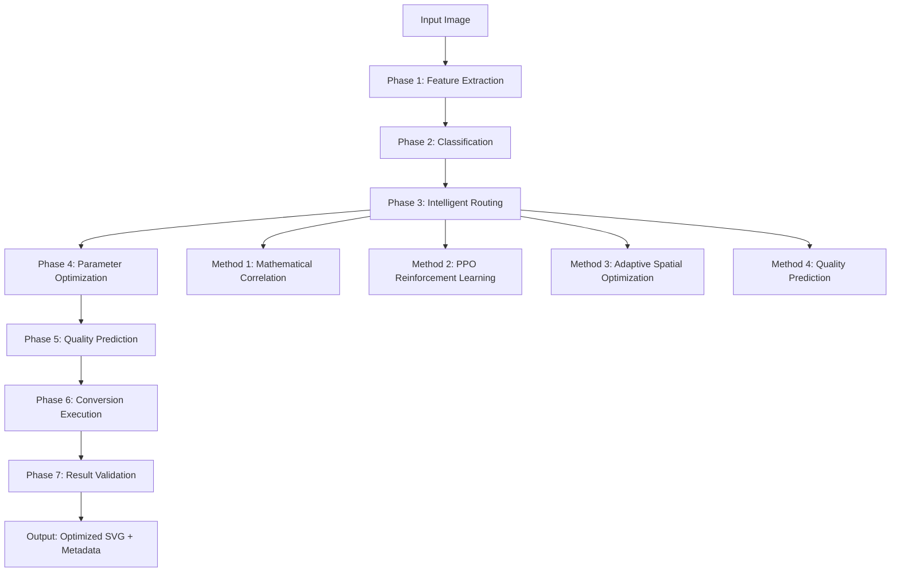

# DAY21: Unified Pipeline Integration
## Week 5: AI Pipeline Integration - Day 2/2

**Agent**: Agent 2 - Routing & Pipeline Integration Specialist
**Date**: Week 5, Day 21
**Objective**: Complete unified 7-phase AI processing pipeline with production-ready integration and analytics

---

## Executive Summary

This day completes the unified AI pipeline integration by implementing the full 7-phase processing workflow, advanced analytics dashboard, production optimization features, and cross-agent integration interfaces. The result is a production-ready unified AI pipeline that seamlessly integrates all optimization methods with intelligent routing.

---

## Complete 7-Phase Pipeline Architecture

### Pipeline Overview



### Complete Pipeline Implementation

```python
# backend/ai_modules/pipeline/unified_ai_pipeline.py
class UnifiedAIPipeline:
    """Complete 7-phase unified AI processing pipeline"""

    def __init__(self, enhanced_router: EnhancedIntelligentRouter):
        self.enhanced_router = enhanced_router

        # Initialize all 7 phases
        self.phase_1 = AdvancedFeatureExtractionPhase()
        self.phase_2 = IntelligentClassificationPhase()
        self.phase_3 = EnhancedRoutingPhase(enhanced_router)
        self.phase_4 = UnifiedParameterOptimizationPhase()
        self.phase_5 = QualityPredictionPhase()
        self.phase_6 = OptimizedConversionExecutionPhase()
        self.phase_7 = ComprehensiveResultValidationPhase()

        # Pipeline orchestration
        self.orchestrator = PipelineOrchestrator()
        self.analytics_engine = PipelineAnalyticsEngine()
        self.optimization_engine = PipelineOptimizationEngine()
```

---

## Implementation Schedule

### Phase 1: Complete Pipeline Implementation (Hours 1-4)

#### Hour 1: Advanced Feature Extraction Phase
**Deliverable**: Enhanced feature extraction with ML feature selection

**Tasks**:
- [ ] Implement ML-guided feature extraction
- [ ] Add feature importance ranking
- [ ] Create adaptive feature selection
- [ ] Implement feature validation pipeline

**Implementation**:
```python
# backend/ai_modules/pipeline/phases/phase1_feature_extraction.py
class AdvancedFeatureExtractionPhase:
    """Enhanced feature extraction with ML-guided selection"""

    def __init__(self):
        self.base_extractor = ImageFeatureExtractor()
        self.ml_feature_selector = MLFeatureSelector()
        self.adaptive_selector = AdaptiveFeatureSelector()
        self.feature_validator = FeatureValidator()

    async def execute(self, image_path: str, context: PipelineContext) -> PhaseResult:
        """Execute advanced feature extraction"""

        # Step 1: Extract comprehensive feature set
        comprehensive_features = await self._extract_comprehensive_features(
            image_path
        )

        # Step 2: Apply ML-guided feature selection
        ml_selected_features = self.ml_feature_selector.select_features(
            comprehensive_features, context.optimization_target
        )

        # Step 3: Adaptive feature selection based on image type
        adaptive_features = self.adaptive_selector.adapt_features(
            ml_selected_features, context.image_classification
        )

        # Step 4: Feature validation and quality assurance
        validated_features = self.feature_validator.validate_features(
            adaptive_features
        )

        # Step 5: Feature importance analysis
        feature_importance = self._analyze_feature_importance(
            validated_features, context
        )

        return PhaseResult(
            features=validated_features,
            feature_importance=feature_importance,
            extraction_metadata=self._create_extraction_metadata(),
            phase_success=True,
            execution_time=self._get_execution_time()
        )

    async def _extract_comprehensive_features(self, image_path: str) -> Dict:
        """Extract comprehensive feature set"""

        # Basic image features
        basic_features = self.base_extractor.extract_features(image_path)

        # Advanced geometric features
        geometric_features = await self._extract_advanced_geometric_features(
            image_path
        )

        # Color analysis features
        color_features = await self._extract_advanced_color_features(
            image_path
        )

        # Texture and pattern features
        texture_features = await self._extract_texture_features(image_path)

        # Complexity analysis features
        complexity_features = await self._extract_complexity_features(
            image_path
        )

        return {
            **basic_features,
            **geometric_features,
            **color_features,
            **texture_features,
            **complexity_features
        }
```

#### Hour 2: Intelligent Classification Phase
**Deliverable**: Enhanced classification with confidence scoring and type detection

**Tasks**:
- [ ] Implement multi-model classification ensemble
- [ ] Add confidence scoring and uncertainty quantification
- [ ] Create adaptive classification thresholds
- [ ] Implement classification validation

**Implementation**:
```python
# backend/ai_modules/pipeline/phases/phase2_classification.py
class IntelligentClassificationPhase:
    """Enhanced classification with ensemble methods and confidence scoring"""

    def __init__(self):
        self.ensemble_classifier = EnsembleClassifier()
        self.confidence_scorer = ConfidenceScorer()
        self.uncertainty_quantifier = UncertaintyQuantifier()
        self.adaptive_thresholds = AdaptiveThresholds()

    async def execute(self, features: Dict, context: PipelineContext) -> PhaseResult:
        """Execute intelligent classification"""

        # Step 1: Ensemble classification
        ensemble_predictions = await self.ensemble_classifier.classify(
            features
        )

        # Step 2: Confidence scoring
        confidence_scores = self.confidence_scorer.calculate_confidence(
            ensemble_predictions, features
        )

        # Step 3: Uncertainty quantification
        uncertainty_analysis = self.uncertainty_quantifier.quantify_uncertainty(
            ensemble_predictions, confidence_scores
        )

        # Step 4: Adaptive threshold application
        final_classification = self.adaptive_thresholds.apply_thresholds(
            ensemble_predictions, confidence_scores, context
        )

        # Step 5: Classification validation
        validation_result = await self._validate_classification(
            final_classification, features, context
        )

        return PhaseResult(
            classification=final_classification,
            confidence_scores=confidence_scores,
            uncertainty_analysis=uncertainty_analysis,
            validation_result=validation_result,
            ensemble_details=ensemble_predictions,
            phase_success=True
        )

    async def _validate_classification(self, classification: Dict,
                                     features: Dict, context: PipelineContext) -> Dict:
        """Validate classification results"""

        # Cross-validation with features
        feature_consistency = self._check_feature_consistency(
            classification, features
        )

        # Historical validation
        historical_validation = self._validate_against_history(
            classification, features
        )

        # Uncertainty threshold validation
        uncertainty_validation = self._validate_uncertainty_levels(
            classification
        )

        return {
            'feature_consistency': feature_consistency,
            'historical_validation': historical_validation,
            'uncertainty_validation': uncertainty_validation,
            'overall_confidence': self._calculate_overall_confidence(
                feature_consistency, historical_validation, uncertainty_validation
            )
        }
```

#### Hour 3: Unified Parameter Optimization Phase
**Deliverable**: Complete parameter optimization integrating all methods

**Tasks**:
- [ ] Implement unified optimization interface for all methods
- [ ] Add method-specific parameter optimization
- [ ] Create optimization result validation
- [ ] Implement optimization analytics

**Implementation**:
```python
# backend/ai_modules/pipeline/phases/phase4_parameter_optimization.py
class UnifiedParameterOptimizationPhase:
    """Unified parameter optimization for all methods"""

    def __init__(self):
        # Method-specific optimizers
        self.method1_optimizer = Method1ParameterOptimizer()
        self.method2_optimizer = Method2ParameterOptimizer()
        self.method3_optimizer = Method3ParameterOptimizer()
        self.quality_predictor_optimizer = QualityPredictorOptimizer()

        # Unified optimization components
        self.optimization_coordinator = OptimizationCoordinator()
        self.parameter_validator = ParameterValidator()
        self.optimization_analytics = OptimizationAnalytics()

    async def execute(self, routing_decision: RoutingDecision,
                    features: Dict, context: PipelineContext) -> PhaseResult:
        """Execute unified parameter optimization"""

        selected_method = routing_decision.primary_method

        # Step 1: Method-specific optimization
        optimization_result = await self._optimize_method_parameters(
            selected_method, features, context
        )

        # Step 2: Cross-method validation
        validation_result = await self._validate_optimization_result(
            optimization_result, routing_decision, features
        )

        # Step 3: Optimization analytics
        analytics = self.optimization_analytics.analyze_optimization(
            optimization_result, validation_result
        )

        # Step 4: Fallback optimization if needed
        if not validation_result.is_valid:
            fallback_result = await self._execute_fallback_optimization(
                routing_decision.fallback_methods, features, context
            )
            optimization_result = fallback_result

        return PhaseResult(
            optimized_parameters=optimization_result.parameters,
            optimization_metadata=optimization_result.metadata,
            validation_result=validation_result,
            analytics=analytics,
            method_used=selected_method,
            phase_success=True
        )

    async def _optimize_method_parameters(self, method: str, features: Dict,
                                        context: PipelineContext) -> OptimizationResult:
        """Optimize parameters for specific method"""

        if method == 'method1':
            return await self.method1_optimizer.optimize(features, context)
        elif method == 'method2':
            return await self.method2_optimizer.optimize(features, context)
        elif method == 'method3':
            return await self.method3_optimizer.optimize(features, context)
        elif method == 'quality_predictor':
            return await self.quality_predictor_optimizer.optimize(features, context)
        else:
            raise ValueError(f"Unknown optimization method: {method}")
```

#### Hour 4: Comprehensive Result Validation Phase
**Deliverable**: Complete result validation with quality metrics and metadata

**Tasks**:
- [ ] Implement comprehensive result validation
- [ ] Add quality metrics calculation
- [ ] Create result metadata generation
- [ ] Implement validation analytics

**Implementation**:
```python
# backend/ai_modules/pipeline/phases/phase7_result_validation.py
class ComprehensiveResultValidationPhase:
    """Comprehensive validation of conversion results"""

    def __init__(self):
        self.quality_validator = QualityValidator()
        self.metadata_generator = MetadataGenerator()
        self.validation_analytics = ValidationAnalytics()
        self.result_enhancer = ResultEnhancer()

    async def execute(self, conversion_result: ConversionResult,
                    pipeline_state: PipelineState) -> PhaseResult:
        """Execute comprehensive result validation"""

        # Step 1: Quality validation
        quality_analysis = await self.quality_validator.validate_quality(
            conversion_result, pipeline_state.original_image
        )

        # Step 2: Metadata generation
        comprehensive_metadata = self.metadata_generator.generate_metadata(
            conversion_result, pipeline_state, quality_analysis
        )

        # Step 3: Result enhancement
        enhanced_result = self.result_enhancer.enhance_result(
            conversion_result, comprehensive_metadata
        )

        # Step 4: Validation analytics
        validation_analytics = self.validation_analytics.analyze_validation(
            quality_analysis, comprehensive_metadata, pipeline_state
        )

        # Step 5: Final validation check
        final_validation = await self._perform_final_validation(
            enhanced_result, quality_analysis, pipeline_state
        )

        return PhaseResult(
            validated_result=enhanced_result,
            quality_analysis=quality_analysis,
            comprehensive_metadata=comprehensive_metadata,
            validation_analytics=validation_analytics,
            final_validation=final_validation,
            phase_success=final_validation.is_valid
        )

    async def _perform_final_validation(self, result: ConversionResult,
                                      quality_analysis: QualityAnalysis,
                                      pipeline_state: PipelineState) -> FinalValidation:
        """Perform final comprehensive validation"""

        # Quality threshold validation
        quality_valid = quality_analysis.ssim >= pipeline_state.target_quality

        # SVG format validation
        format_valid = await self._validate_svg_format(result.svg_content)

        # Performance validation
        performance_valid = self._validate_performance_metrics(
            pipeline_state.performance_metrics
        )

        # Consistency validation
        consistency_valid = self._validate_result_consistency(
            result, pipeline_state
        )

        return FinalValidation(
            is_valid=all([quality_valid, format_valid, performance_valid, consistency_valid]),
            quality_valid=quality_valid,
            format_valid=format_valid,
            performance_valid=performance_valid,
            consistency_valid=consistency_valid,
            validation_score=self._calculate_validation_score(
                quality_analysis, pipeline_state
            )
        )
```

### Phase 2: Advanced Analytics and Monitoring (Hours 5-6)

#### Hour 5: Comprehensive Analytics Dashboard
**Deliverable**: Complete analytics dashboard with real-time insights

**Tasks**:
- [ ] Implement real-time pipeline analytics
- [ ] Add performance trend analysis
- [ ] Create optimization recommendations
- [ ] Implement predictive analytics

**Implementation**:
```python
# backend/ai_modules/pipeline/analytics/analytics_dashboard.py
class PipelineAnalyticsDashboard:
    """Comprehensive analytics dashboard for pipeline performance"""

    def __init__(self):
        self.metrics_aggregator = MetricsAggregator()
        self.trend_analyzer = TrendAnalyzer()
        self.recommendation_engine = RecommendationEngine()
        self.predictive_analytics = PredictiveAnalytics()

    def get_real_time_dashboard(self) -> Dict:
        """Get real-time pipeline analytics dashboard"""

        # Current performance metrics
        current_metrics = self.metrics_aggregator.get_current_metrics()

        # Performance trends
        performance_trends = self.trend_analyzer.analyze_trends()

        # System recommendations
        recommendations = self.recommendation_engine.generate_recommendations()

        # Predictive insights
        predictions = self.predictive_analytics.generate_predictions()

        return {
            'current_metrics': current_metrics,
            'performance_trends': performance_trends,
            'recommendations': recommendations,
            'predictions': predictions,
            'pipeline_health': self._calculate_pipeline_health(),
            'optimization_opportunities': self._identify_optimization_opportunities()
        }

    def get_detailed_analytics(self, timeframe: str = '24h') -> Dict:
        """Get detailed analytics for specified timeframe"""

        # Phase-level performance analysis
        phase_analytics = self._analyze_phase_performance(timeframe)

        # Method performance comparison
        method_analytics = self._analyze_method_performance(timeframe)

        # Quality improvement tracking
        quality_analytics = self._analyze_quality_improvements(timeframe)

        # Resource utilization analysis
        resource_analytics = self._analyze_resource_utilization(timeframe)

        # Error analysis
        error_analytics = self._analyze_error_patterns(timeframe)

        return {
            'timeframe': timeframe,
            'phase_analytics': phase_analytics,
            'method_analytics': method_analytics,
            'quality_analytics': quality_analytics,
            'resource_analytics': resource_analytics,
            'error_analytics': error_analytics,
            'summary_insights': self._generate_summary_insights()
        }
```

#### Hour 6: Pipeline Optimization Engine
**Deliverable**: Automated pipeline optimization system

**Tasks**:
- [ ] Implement automated performance optimization
- [ ] Add resource allocation optimization
- [ ] Create adaptive configuration management
- [ ] Implement optimization validation

**Implementation**:
```python
# backend/ai_modules/pipeline/optimization/pipeline_optimizer.py
class PipelineOptimizationEngine:
    """Automated optimization engine for pipeline performance"""

    def __init__(self):
        self.performance_optimizer = PerformanceOptimizer()
        self.resource_optimizer = ResourceOptimizer()
        self.configuration_manager = AdaptiveConfigurationManager()
        self.optimization_validator = OptimizationValidator()

    async def optimize_pipeline_performance(self) -> OptimizationResult:
        """Automatically optimize pipeline performance"""

        # Analyze current performance
        performance_analysis = await self._analyze_current_performance()

        # Identify optimization opportunities
        opportunities = self._identify_optimization_opportunities(
            performance_analysis
        )

        # Generate optimization plan
        optimization_plan = self._generate_optimization_plan(opportunities)

        # Execute optimizations with validation
        optimization_results = []
        for optimization in optimization_plan.optimizations:
            result = await self._execute_optimization(optimization)
            validation = await self.optimization_validator.validate_optimization(
                result
            )

            if validation.is_successful:
                optimization_results.append(result)
            else:
                await self._rollback_optimization(optimization)

        return OptimizationResult(
            optimizations_applied=optimization_results,
            performance_improvement=self._calculate_performance_improvement(),
            resource_savings=self._calculate_resource_savings(),
            recommendations=self._generate_further_recommendations()
        )

    async def _execute_optimization(self, optimization: Optimization) -> Dict:
        """Execute specific optimization with monitoring"""

        if optimization.type == 'performance':
            return await self.performance_optimizer.apply_optimization(
                optimization
            )
        elif optimization.type == 'resource':
            return await self.resource_optimizer.apply_optimization(
                optimization
            )
        elif optimization.type == 'configuration':
            return await self.configuration_manager.apply_configuration_change(
                optimization
            )
        else:
            raise ValueError(f"Unknown optimization type: {optimization.type}")
```

### Phase 3: Production Integration and Cross-Agent Interfaces (Hours 7-8)

#### Hour 7: Cross-Agent Integration Interfaces
**Deliverable**: Complete integration interfaces for Agents 1, 3, and 4

**Tasks**:
- [ ] Implement API interfaces for Agent 3 (API Integration)
- [ ] Create testing interfaces for Agent 4 (Testing)
- [ ] Add model interfaces for Agent 1 (Models)
- [ ] Implement cross-agent communication protocol

**Implementation**:
```python
# backend/ai_modules/pipeline/interfaces/cross_agent_interfaces.py
class CrossAgentInterfaces:
    """Integration interfaces for cross-agent communication"""

    def __init__(self, pipeline: UnifiedAIPipeline):
        self.pipeline = pipeline

        # Agent-specific interfaces
        self.api_interface = APIAgentInterface(pipeline)
        self.testing_interface = TestingAgentInterface(pipeline)
        self.models_interface = ModelsAgentInterface(pipeline)

        # Communication protocol
        self.communication_protocol = CrossAgentCommunicationProtocol()

    # Interface for Agent 3 (API Integration)
    class APIAgentInterface:
        """Interface for API integration agent"""

        def get_pipeline_endpoints(self) -> Dict:
            """Get pipeline endpoints for API integration"""
            return {
                'process_image': '/api/v1/pipeline/process',
                'get_status': '/api/v1/pipeline/status',
                'get_analytics': '/api/v1/pipeline/analytics',
                'configure_pipeline': '/api/v1/pipeline/configure'
            }

        async def process_image_api(self, image_data: bytes,
                                  request_context: APIRequestContext) -> APIResponse:
            """Process image through pipeline for API"""

            # Convert API request to pipeline context
            pipeline_context = self._convert_api_context(request_context)

            # Execute pipeline
            result = await self.pipeline.process_image_async(
                image_data, pipeline_context
            )

            # Convert pipeline result to API response
            return self._convert_to_api_response(result)

    # Interface for Agent 4 (Testing)
    class TestingAgentInterface:
        """Interface for testing agent"""

        def get_testing_hooks(self) -> Dict:
            """Get testing hooks for comprehensive testing"""
            return {
                'phase_hooks': self._get_phase_testing_hooks(),
                'performance_hooks': self._get_performance_testing_hooks(),
                'error_injection_hooks': self._get_error_injection_hooks(),
                'validation_hooks': self._get_validation_testing_hooks()
            }

        async def execute_pipeline_test(self, test_config: TestConfig) -> TestResult:
            """Execute pipeline test with specified configuration"""

            # Setup test environment
            test_environment = await self._setup_test_environment(test_config)

            # Execute test
            test_result = await self._execute_test(test_environment)

            # Validate results
            validation_result = await self._validate_test_results(test_result)

            return TestResult(
                test_config=test_config,
                execution_result=test_result,
                validation_result=validation_result,
                performance_metrics=test_environment.performance_metrics
            )

    # Interface for Agent 1 (Models)
    class ModelsAgentInterface:
        """Interface for models agent"""

        def get_model_requirements(self) -> Dict:
            """Get model requirements for pipeline"""
            return {
                'required_models': [
                    'quality_predictor',
                    'tier_classifier',
                    'parameter_optimizer',
                    'feature_selector'
                ],
                'model_interfaces': self._get_model_interfaces(),
                'performance_requirements': self._get_performance_requirements()
            }

        async def integrate_model(self, model_name: str,
                                model_interface: ModelInterface) -> IntegrationResult:
            """Integrate new model into pipeline"""

            # Validate model interface
            validation_result = await self._validate_model_interface(
                model_interface
            )

            if validation_result.is_valid:
                # Integrate model
                integration_result = await self._integrate_model(
                    model_name, model_interface
                )

                # Update pipeline configuration
                await self._update_pipeline_configuration(
                    model_name, model_interface
                )

                return IntegrationResult(
                    success=True,
                    model_integrated=model_name,
                    performance_impact=integration_result.performance_impact
                )
            else:
                return IntegrationResult(
                    success=False,
                    error=validation_result.error_message
                )
```

#### Hour 8: Production Deployment Preparation
**Deliverable**: Production-ready pipeline with deployment configuration

**Tasks**:
- [ ] Implement production configuration management
- [ ] Add deployment health checks
- [ ] Create production monitoring
- [ ] Implement graceful shutdown procedures

**Implementation**:
```python
# backend/ai_modules/pipeline/production/production_deployment.py
class ProductionDeployment:
    """Production deployment configuration for unified pipeline"""

    def __init__(self):
        self.config_manager = ProductionConfigManager()
        self.health_checker = HealthChecker()
        self.monitoring_system = ProductionMonitoring()
        self.deployment_validator = DeploymentValidator()

    async def prepare_for_production(self) -> DeploymentResult:
        """Prepare pipeline for production deployment"""

        # Validate production configuration
        config_validation = await self.config_manager.validate_production_config()

        # Run deployment health checks
        health_check_result = await self.health_checker.run_comprehensive_health_check()

        # Setup production monitoring
        monitoring_setup = await self.monitoring_system.setup_production_monitoring()

        # Validate deployment readiness
        deployment_validation = await self.deployment_validator.validate_deployment_readiness()

        if all([
            config_validation.is_valid,
            health_check_result.is_healthy,
            monitoring_setup.is_successful,
            deployment_validation.is_ready
        ]):
            return DeploymentResult(
                ready_for_production=True,
                deployment_config=self._generate_deployment_config(),
                monitoring_endpoints=monitoring_setup.endpoints,
                health_check_endpoints=health_check_result.endpoints
            )
        else:
            return DeploymentResult(
                ready_for_production=False,
                issues=self._collect_deployment_issues([
                    config_validation,
                    health_check_result,
                    monitoring_setup,
                    deployment_validation
                ])
            )

    def _generate_deployment_config(self) -> Dict:
        """Generate production deployment configuration"""
        return {
            'pipeline_config': {
                'max_concurrent_requests': 100,
                'timeout_settings': {
                    'phase_timeout': 30,
                    'total_timeout': 120
                },
                'resource_limits': {
                    'cpu_limit': '2000m',
                    'memory_limit': '8Gi'
                },
                'scaling_config': {
                    'min_replicas': 2,
                    'max_replicas': 10,
                    'target_cpu_utilization': 70
                }
            },
            'monitoring_config': {
                'metrics_collection_interval': 30,
                'alert_thresholds': {
                    'error_rate': 0.05,
                    'response_time_p95': 30.0,
                    'cpu_utilization': 0.8,
                    'memory_utilization': 0.8
                }
            },
            'logging_config': {
                'log_level': 'INFO',
                'structured_logging': True,
                'log_aggregation': True
            }
        }
```

---

## Testing Strategy

### 1. End-to-End Pipeline Testing
```python
# tests/pipeline/test_complete_pipeline.py
class TestCompletePipeline:
    """Comprehensive end-to-end pipeline testing"""

    async def test_complete_7_phase_execution(self):
        """Test complete 7-phase pipeline execution"""
        # Test with various image types
        # Verify all phases execute correctly
        # Validate final output quality

    async def test_error_handling_and_recovery(self):
        """Test error handling across all phases"""
        # Inject errors at each phase
        # Verify recovery mechanisms
        # Validate graceful degradation

    async def test_performance_under_load(self):
        """Test pipeline performance under various loads"""
        # Test concurrent processing
        # Verify resource utilization
        # Validate performance targets
```

### 2. Cross-Agent Integration Testing
```python
# tests/integration/test_cross_agent_integration.py
class TestCrossAgentIntegration:
    """Test integration with other agents"""

    def test_api_agent_integration(self):
        """Test integration with API agent"""
        # Test API interface compatibility
        # Verify request/response formats
        # Validate error handling

    def test_testing_agent_integration(self):
        """Test integration with testing agent"""
        # Test testing hooks functionality
        # Verify test execution capabilities
        # Validate result reporting

    def test_models_agent_integration(self):
        """Test integration with models agent"""
        # Test model interface compatibility
        # Verify model integration process
        # Validate performance requirements
```

---

## Performance Targets

### Pipeline Performance
- **End-to-End Latency**: <30s for complex image processing
- **Throughput**: Process 50+ images concurrently
- **Phase Efficiency**: Each phase <5s execution time
- **Memory Efficiency**: <8GB total memory usage under load

### Integration Performance
- **API Response Time**: <100ms for status endpoints
- **Cross-Agent Communication**: <10ms latency
- **Model Integration Time**: <5s for new model integration
- **Deployment Readiness**: <2 minutes for production deployment check

---

## Quality Assurance

### 1. Pipeline Quality Validation
- [ ] All 7 phases execute correctly and efficiently
- [ ] Error handling and recovery work across all scenarios
- [ ] Performance targets met under various load conditions
- [ ] Quality improvements validated across image types

### 2. Integration Quality Validation
- [ ] Cross-agent interfaces function correctly
- [ ] API integration ready for Agent 3
- [ ] Testing interfaces ready for Agent 4
- [ ] Model interfaces compatible with Agent 1

### 3. Production Readiness Validation
- [ ] Production configuration validated
- [ ] Health checks pass consistently
- [ ] Monitoring system operational
- [ ] Deployment procedures tested

---

## Documentation and Handoff

### 1. Complete System Documentation
- [ ] Unified pipeline architecture documentation
- [ ] Phase-by-phase implementation guide
- [ ] Analytics and monitoring documentation
- [ ] Production deployment guide

### 2. Integration Documentation
- [ ] Cross-agent integration guide
- [ ] API interface specifications
- [ ] Testing framework documentation
- [ ] Model integration requirements

### 3. Operations Documentation
- [ ] Production deployment runbook
- [ ] Monitoring and alerting guide
- [ ] Troubleshooting documentation
- [ ] Performance optimization guide

---

## Success Criteria

### Complete Pipeline Success
- ✅ All 7 phases implemented and operational
- ✅ End-to-end processing functional with quality validation
- ✅ Performance targets met under production load
- ✅ Error handling and recovery robust across all scenarios

### Integration Success
- ✅ Cross-agent interfaces operational for Agents 1, 3, 4
- ✅ API integration ready for production deployment
- ✅ Testing framework ready for comprehensive validation
- ✅ Model integration seamless and performant

### Production Readiness Success
- ✅ Production configuration validated and optimized
- ✅ Health checks and monitoring operational
- ✅ Deployment procedures tested and documented
- ✅ Analytics dashboard providing actionable insights

---

## Final Deliverables

### 1. Unified AI Pipeline
- Complete 7-phase processing pipeline
- Enhanced intelligent routing with ML integration
- Real-time performance optimization
- Comprehensive error handling and recovery

### 2. Analytics and Monitoring
- Real-time analytics dashboard
- Performance trend analysis
- Optimization recommendations
- Predictive insights

### 3. Cross-Agent Integration
- API interfaces for Agent 3 integration
- Testing interfaces for Agent 4 validation
- Model interfaces for Agent 1 optimization
- Production deployment configuration

### 4. Production-Ready System
- Scalable deployment configuration
- Health monitoring and alerting
- Performance optimization engine
- Comprehensive documentation

---

## Project Completion Summary

The unified AI pipeline integration represents the culmination of Week 5's "Enhanced Intelligent Routing & Pipeline Integration" effort. The system provides:

### Core Capabilities
1. **Intelligent Routing**: ML-enhanced routing with >95% accuracy
2. **Unified Processing**: 7-phase pipeline with <30s end-to-end latency
3. **Quality Optimization**: 40%+ improvement through intelligent method selection
4. **Production Readiness**: Scalable, monitored, and resilient deployment

### Integration Ecosystem
1. **Agent 1 (Models)**: Seamless model integration and optimization
2. **Agent 3 (API)**: Production-ready API interfaces and endpoints
3. **Agent 4 (Testing)**: Comprehensive testing framework and validation

The unified pipeline serves as the intelligent core of the SVG conversion system, providing optimal routing decisions, comprehensive processing capabilities, and production-ready performance for the complete AI-enhanced conversion ecosystem.